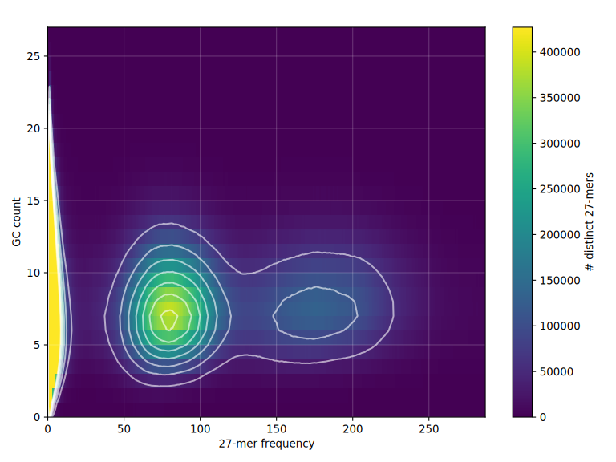

# *Platynothrus peltifer* genome analysis
*Platynothrus peltifer* genome with haplotype-specific analyses 

## Table of contents
* [Genome assembly pipeline](#Genome-assembly-pipeline)

## Genome assembly pipeline

### *k*-mer analysis

[KAT](https://github.com/TGAC/KAT) version 2.4.2
```sh
kat hist -o kat_hist hifi_reads.fastq.gz
kat gcp -o kat_gcp hifi_reads.fastq.gz
```

 

[Smudgeplot](https://github.com/KamilSJaron/smudgeplot) version 0.2.5
[KMC](https://github.com/tbenavi1/KMC) version 
```sh
mkdir tmp_smudge
ls hifi_reads.fastq.gz > FILES
kmc -k27 -ci1 -cs10000 @FILES kmcdb tmp_smudge
kmc_tools transform kmcdb histogram kmcdb_k27.hist -cx10000

L=$(smudgeplot.py cutoff kmcdb_k27.hist L)
U=$(smudgeplot.py cutoff kmcdb_k27.hist U)
echo $L $U

kmc_tools transform kmcdb -ci"$L" -cx"$U" dump -s kmcdb_L"$L"_U"$U".dump
smudgeplot.py hetkmers -o kmcdb_L"$L"_U"$U" < kmcdb_L"$L"_U"$U".dump

smudgeplot.py plot kmcdb_L"$L"_U"$U"_coverages.tsv
```

### *De novo* assembly

[hifiasm](https://github.com/chhylp123/hifiasm) version 0.16.1-r375
```sh
hifiasm -o assembly hifi_reads.fastq.gz
```

### TELL-seq linked reads improve assembly by Scaff10X
	/home/shangao/Software/Assembly/Scaff10X/src/scaff10x \
    -nodes 30 -longread 1 -gap 100 -matrix 2000 -reads 10 -score 10 -edge 50000 -link 8 -block 50000 -plot Ppr_result/barcode_lengtg.png \
    /home/shangao/Scratch/gaoshan/hifiasm/genome/Ppr_new/Ppr_new.fa \
    genome-BC_1.fastq.gz \
    genome-BC_2.fastq.gz \
    output_scaffolds.fastae

### Omni-C scaffolding 

[bwa](https://github.com/lh3/bwa) version 0.7.15
[hicstuff](https://github.com/koszullab/hicstuff) version 3.1.1

```sh
hicstuff pipeline -e 100 -a bwa -g assembly.fasta -m iterative \
	-o hicstuff_out omnic.trimmed.end1.fastq omnic.trimmed.end2.fastq
```

[instaGRAAL](https://github.com/koszullab/instaGRAAL) version 0.1.6 no-opengl branch

```sh
instagraal --level 5 --cycles 100 hicstuff_out assembly.fasta instagraal_out
```

```sh
instagraal-polish -m polishing -f assembly.purged.fasta -j NNNNNNNNNN \
	-i instagraal_out/hicstuff_out/test_mcmc5/info_frags.txt \
	-o assembly.hic_scaffolds.fasta
```
	
### Gap filling

[TGS-GapCloser](https://github.com/BGI-Qingdao/TGS-GapCloser) version 1.1.1

TGS-GapCloser.sh --scaff scaffolds.fasta \
	--reads /home/shangao/Data/../mites/reads/PacBio/Ppr/m64093_200831_134054.Q20.fastq.gz \
	--output gap_filled \
	--tgstype pb --ne \
	--minmap_arg '-x asm20'

### Polishing 

[HyPo](https://github.com/kensung-lab/hypo) v1.0.3
```sh
hypo -d gap_filled.fasta -r hifi_reads.fastq.gz -s 200m -c 100 -b mapped-ccs.sorted.bam \
	-o polished.fasta
```

### Assembly evaluation

[BUSCO](https://busco.ezlab.org/) version 5.0.0

```sh
busco -i final_scaffolds.fasta -m genome -o busco_out_arachnida_odb10 -l arachnida_odb10
busco -i final_scaffolds.fasta -m genome -o busco_out_arthropoda_odb10 -l arthropoda_odb10
```

[BlobTools2](https://blobtoolkit.genomehubs.org/blobtools2/) version 2.3.3
[minimap2](https://github.com/lh3/minimap2) version 2.24r1122
```sh
minimap2 -ax map-hifi hap0.fasta hifi_reads.fastq.gz 
```

## Genome annotation


## TO DO
1. please add all paths to the basic data

## VCF calling
Data
- reference: Ppr_instagrall.polished.FINAL.softmask.fa
- bamfiles: /home/hoeztopr/Data/hoeztopr/VCFcalling/GATK_version/bamfilenames.list (/RAID/Data/gaoshan/hifiasm_tell-sort/)
- haplotypes: /home/hoeztopr/Data/hoeztopr/VCFcalling/GATK_version #generated with GATK HaplotypeCaller

1. GATK: /home/hoeztopr/Data/hoeztopr/Scripts/vcfcall.txt
software: /NVME/Software/popgen/gatk-4.1.9.0/gatk
- In short: CombineGVCF - GenotypeGVCFs - SelectVariants

Path_to_data: /home/hoeztopr/Data/hoeztopr/VCFcalling/GATK_version

2. Freebayes: /home/hoeztopr/Data/hoeztopr/Scripts/Freebayes.txt
software= ~/Software/popgen/freebayes1.3.0/freebayes-v1.3.0-1
- In short: version a) simple call variants -> Ppr.fb.vcf b) with population information -> Ppr.pop.fb.vcf 
- Filtering: GATK SelectVariants(Ppr.fb.gatk.snp.gz) + Hardfiltering:VariantFiltration (Ppr.fb.gatk.snp.f.gz)

Path_to_data: /home/hoeztopr/Data/hoeztopr/VCFcalling/Freebayes

3. TELL-sort
VCF provided by Shan: Ppr.merged.vcf.gz
- Filtering: VCFtools (Ppr.SHAN.filtered.recode.vcf) # Hardfiltering: Ppr.SHAN.filtered_GATKhard.vcf.gz

Path_to_data: /home/hoeztopr/Scratch/hoeztopr/nucdiv/SHAN_VCF
123
